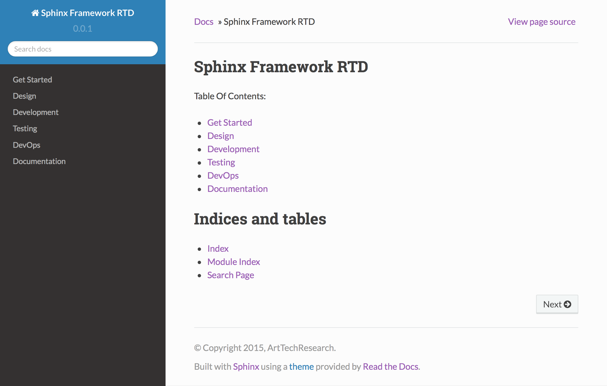

##############################################
Sphinx Framework RTD
##############################################

This is the sphinx docs template for the project development docs with
ReadTheDocs theme.

***********************
Features
***********************

* added sphinx-autobuild to auto run with the command ``make autohtml``
* changed the theme as `sphinx_rtd_theme`
* added the document structure

***********************
Get Started
***********************

Setup

::

    $ cd /path/to/project/
    $ git clone https://github.com/KellyChan/sphinx-framework-rtd.git
    $ cd sphinx-frameword-rtd
    $ pip install -r requirements/xxxx

Run the server

::

    $ cd docs/
    $ make autohtml
    sphinx-autobuild -b html -d _build/doctrees   . _build/html
    [I 160125 20:50:43 server:271] Serving on http://127.0.0.1:8000
    [I 160125 20:50:43 handlers:58] Start watching changes
    [I 160125 20:50:43 handlers:60] Start detecting changes

Preview

***********************
LICENSE
***********************

`MIT LICENSE`_

.. _`MIT LICENSE`: ./LICENSE
